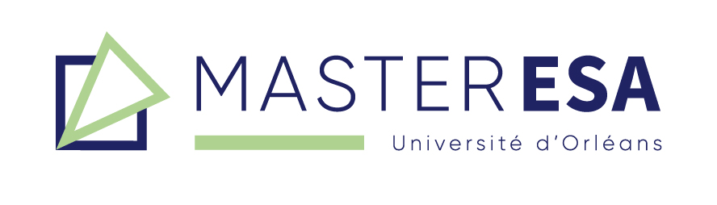

     
     

# Neural Networks for Credit Scoring    

In this project we use Artificial Neural Networks in order to model the credit granting decision. The performance of Artificial Neural Networks in the context of credit scoring is then compared to:

- Linear Logistic Regression
- Penalized Linear Logistic Regression (RIDGE and LASSO)
- Decision Trees
- Random Forest
- Gradient Boosting
- SVM
  
  
### Useful Links  
  
- Shiny Application: https://belgadazainab.shinyapps.io/scoring_neurons/
- Commented Core Code: https://github.com/belzaina/scoring_neurons/tree/master/scripts
  
  
### About  
  
This project was conducted by [ZAINAB BELGADA](https://fr.linkedin.com/in/za%C3%AFnab-belgada-b1175b1ab) and [CLARISSE IRANKURIZA](https://www.linkedin.com/in/clarisse-irankuriza-54298b19b) under the supervision of Professor [ABDOUL AZIZ NDOYE](http://www.leo-univ-orleans.fr/fr/membres/#abdoul-aziz.ndoye@univ-orleans.fr) for 2021 [Master ESA](https://www.univ-orleans.fr/deg/masters/ESA/) Réseaux de Neurones class at [University of Orléans](https://www.univ-orleans.fr/fr/univ).  
  
    
 

